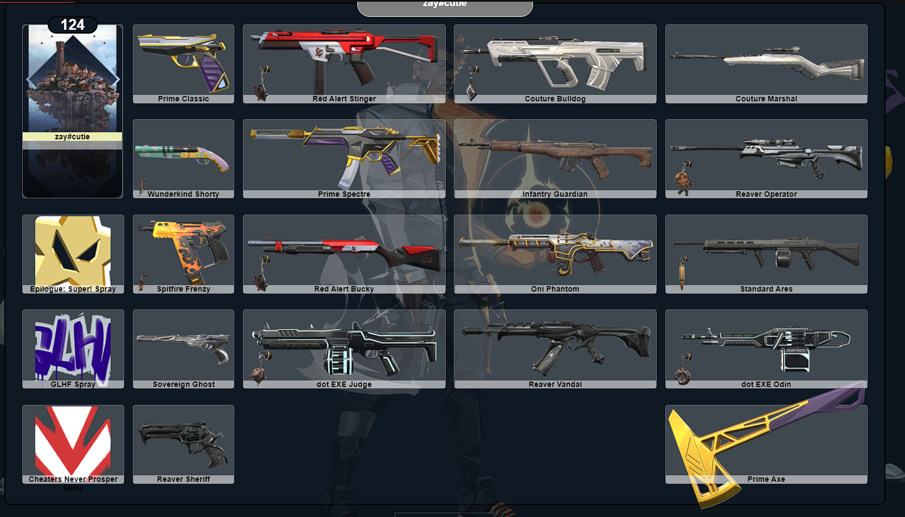
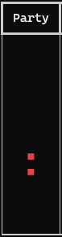

    
<h1 align="center">ValoAssist</h1>
<h3 align="center">Only works on Win10, Win11</h3>

[![Downloads][downloads-shield]][downloads-url]
    
 
  <ol>
    <li><a href="#about-the-project">About The Project</a></li>
    <li><a href="#usage">Usage</a></li>
    <li><a href="#contributing">Contributing</a></li>
    <li><a href="#acknowledgements">Acknowledgements</a></li>
    <li><a href="#disclaimer">Disclaimer</a></li>
  </ol>

    
## About The Project

 
 

|Their Queue|Current Skin|Current Rank|Rank Rating|Peak Rank|Account Level|
|:---:|:---:|:---:|:---:|:---:|:---:|
|||||||
    

## Usage
1) Open VALORANT
2) Run VAS.exe **WITHOUT Administrator privilege is recommended**

### Bundled Release(***Recommended***):

1) Download [Microsoft Visual C++ Libraries](https://github.com/abbodi1406/vcredist/releases)
2) Download the [release](https://github.com/scottjsh/ValoAssist/releases/latest).
3) Extract **all** files.
4) Run VAS.exe.

### Running from source:

1) Download [Python 3.10](https://www.python.org/downloads/release/python-3100/), make sure it is added to the PATH. (This is an option on installation.)
   1) Any Python version post 3.10 should work.
2) Download the [source](https://github.com/scottjsh/ValoAssist/archive/refs/heads/main.zip).
3) Open a terminal within the source folder.
4) `pip install -r requirements.txt`
5) `main.py`

### Compiling from source:

1) `pip install cx_Freeze`
2) `python setup.py build`
3)  Open the new Build folder and find VAS.exe.

> `-` You can change the desired weapon by editing the gun in `config.json`, or by deleting the file for VAS re-prompt you.

## What about that Tweet?

 The [Tweet](https://twitter.com/PlayVALORANT/status/1539728676815642624), which details Riot's API policies, outlines how
 applications are not allowed to expose data hidden by the game client. As of Version 1.262, VAS respects streamer mode.

## Contributing

 Any contributions you make are **greatly appreciated**.

## Acknowledgements

 - [Valorant-API.com](https://valorant-api.com/)
 
## Disclaimer

 THIS PROJECT IS NOT ASSOCIATED OR ENDORSED BY RIOT GAMES. Riot Games, and all associated properties are trademarks or registered trademarks of Riot Games, Inc.
    
 Whilst effort has been made to abide by Riot's API rules; you acknowledge that use of this software is done so at your own risk.

[downloads-shield]: https://img.shields.io/github/downloads/scottjsh/ValoAssist/total?style=for-the-badge&logo=github
[downloads-url]: https://github.com/scottjsh/ValoAssist/releases/latest
